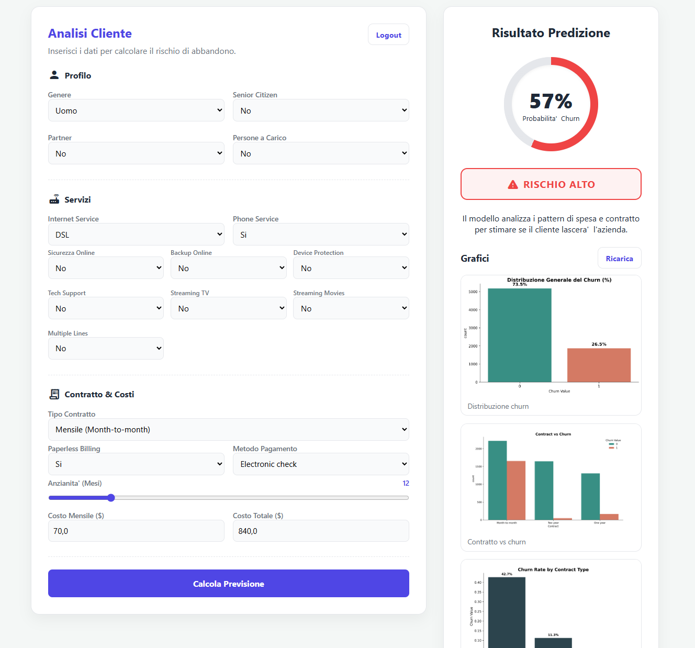

# Customer Churn Prediction System

End-to-end demo project: data preprocessing + ML training (XGBoost) + FastAPI backend + simple frontend dashboard.

## Screenshot



## What You Get

- ML pipeline (preprocess, train, evaluate, predict)
- FastAPI API for predictions and pipeline triggers
- Static frontend (HTML/CSS/JS) with:
  - Admin-only login (demo)
  - Churn prediction form
  - Plots gallery loaded from `/outputs-frontend`

## Repository Layout

```
Customer-Churn-Prediction-System/
  analysis/
    plots.py
  backend/
    api.py
  data/
    raw/
      Telco_customer_churn.csv
    processed/
      train_raw.csv
      test_raw.csv
  frontend/
    index.html
    script.js
    style.css
  ml/
    preprocessing.py
    train_model.py
    evaluate.py
    predict.py
  models/
    churn_pipeline_v1.joblib
  outputs/
    metrics.csv
    classification_report.txt
    confusion_matrix_xgb.png
    plots/
  outputs_front-end/
    *.png
  requirements.txt
```

## Quickstart

### 1) Create venv + install deps

Windows (PowerShell):

```powershell
python -m venv .venv
.\.venv\Scripts\Activate.ps1
pip install -r requirements.txt
```

macOS/Linux:

```bash
python3 -m venv .venv
source .venv/bin/activate
pip install -r requirements.txt
```

### 2) Run the ML pipeline (optional but recommended)

```powershell
# Preprocess raw data -> data/processed/*.csv
python .\ml\preprocessing.py

# Train model -> models/churn_pipeline_v1.joblib (plus diagnostics in models/)
python .\ml\train_model.py

# Evaluate -> outputs/metrics.csv + confusion matrix
python .\ml\evaluate.py
```

### 3) Start the backend API

```powershell
uvicorn backend.api:app --reload
```

API will be available at:
- `http://127.0.0.1:8000`
- Swagger UI: `http://127.0.0.1:8000/docs`

### 4) Start the frontend

The frontend is static. You should serve it with a local web server.

Option A (Python):

```powershell
cd .\frontend
python -m http.server 5173
```

Then open: `http://127.0.0.1:5173`

Option B: VS Code Live Server (or any static server).

## Admin Login (Demo)

The dashboard is protected by a very simple demo login:

- Username: `admin`
- Password: `admin`

Note: this is client-side only (sessionStorage). It is for demo UI gating, not real security.

## API Endpoints

Base URL: `http://127.0.0.1:8000`

- `GET /` health check
- `POST /predict` single-customer churn prediction
- `POST /preprocess` runs `ml.preprocessing.main()`
- `POST /train` runs `ml.train_model.run_training_pipeline(...)`
- `POST /evaluate` runs `ml.evaluate.evaluate_model(...)`
- `POST /generate-plots` generates a small set of PNGs for the frontend gallery
- `GET /outputs/...` static files from `outputs/`
- `GET /outputs-frontend/...` static files from `outputs_front-end/`

### Example: `/predict`

Request body (JSON):

```json
{
  "Gender": "Male",
  "SeniorCitizen": 0,
  "Partner": "Yes",
  "Dependents": "No",
  "tenure": 12,
  "PhoneService": "Yes",
  "MultipleLines": "No",
  "InternetService": "Fiber optic",
  "OnlineSecurity": "No",
  "OnlineBackup": "Yes",
  "DeviceProtection": "No",
  "TechSupport": "No",
  "StreamingTV": "Yes",
  "StreamingMovies": "No",
  "Contract": "Month-to-month",
  "PaperlessBilling": "Yes",
  "PaymentMethod": "Electronic check",
  "MonthlyCharges": 70.0,
  "TotalCharges": 840.0
}
```

Response (example):

```json
{
  "model_used": "xgb_pipeline",
  "churn_probability": 0.42,
  "prediction": 0
}
```

## Notes On Data Schema

- The ML pipeline uses a spaced-column schema in training data (e.g. `Churn Value`, `Tenure Months`).
- The API accepts frontend-friendly keys without spaces (e.g. `tenure`, `MonthlyCharges`).
- `ml/predict.py` aligns the incoming record to the model's expected feature set.

## Tech Stack

- Python
- Pandas / NumPy
- scikit-learn
- XGBoost + Optuna
- FastAPI + Uvicorn
- Matplotlib / Seaborn
- Vanilla HTML/CSS/JS frontend